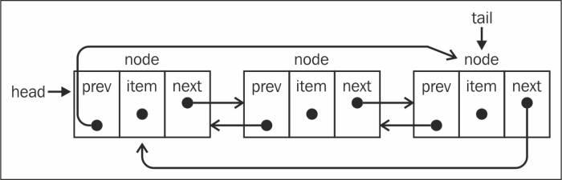

<h3>Essentials:</h3>
<ul>
    <li><strong>What</strong>: A dynamic, cyclic, bidirectional linear data structure.</li>
    <ul>
        <li><strong>Best:</strong> Insertion & Deletion at Head and Tail: O(1) and repetitive processes.</li>
        <ul>
            <li><strong>Example:</strong> Tabs in a Web Browser.</li>
        </ul>
        <li><strong>Worst:</strong> Random Insertion & Deletion & Search & Sort: O(N) ~ O(N^2)</li>
    </ul>
    <li><strong>Variations:</strong></li>
    <ul>
        <li><strong>Double Linked List:</strong></li>
        <ul>
            <li><strong>Difference:</strong> Last node does not point back to Head.</li>
            <li><strong>Best:</strong> Non repetitive processes.</li>
            <ul>
                <li><strong>Example:</strong> Slideshow.</li>
            </ul>
        </ul>
    </ul>
</ul>